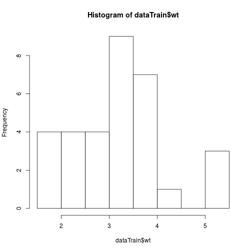

Shiny Project Presentation
========================================================
author: Taha Bakhouch
date: 28/10/2016

Prediction UI
========================================================
**Importing Data** 

By importing a csv file, the following the coding code gets executed :

```r
dataTrain<-read.csv("mtcar/mtcars.csv") ##assuming we import the mtcars that contains the mtcars dataset
colsNames<-colnames(dataTrain)
```

Prediction UI
========================================================
**Exploring Data** 
the Explore View allows exloring data using histograms and barplots.

```r
hist(dataTrain$wt)
```



Prediction UI
========================================================
**Building Model Data**
By the selecting feature && the model && the predicted variable, we can build a model using the button "Go Modeling"

```r
##assuming we selected ("hp","drat") as predicators ; a linear model 
##and the predictable variable is "wt""
library(caret)
myModel<-train(x=dataTrain[,c("hp","drat")],
                y=dataTrain[,c("wt")],method="lm")
myModel
```

```
Linear Regression 

32 samples
 2 predictors

No pre-processing
Resampling: Bootstrapped (25 reps) 
Summary of sample sizes: 32, 32, 32, 32, 32, 32, ... 
Resampling results:

  RMSE      Rsquared 
  0.645684  0.6389105

 
```

Prediction UI
========================================================
**Predicting Values**
To use the built model, you just have to import csv file containing the test data


```r
## lets use the same training data for testing 
resultPredict<-predict(myModel,dataTrain[,c("hp","drat")])
unlist(resultPredict)
```

```
       1        2        3        4        5        6        7        8 
2.705161 2.705161 2.649924 3.488366 3.815303 3.763715 4.182083 2.614934 
       9       10       11       12       13       14       15       16 
2.595182 2.764817 2.764817 3.922005 3.922005 3.922005 4.207183 4.200908 
      17       18       19       20       21       22       23       24 
4.072105 2.266668 1.369991 2.126892 2.817427 4.036343 3.663843 3.685417 
      25       26       27       28       29       30       31       32 
3.882162 2.266668 2.083833 2.847503 3.332514 3.366393 4.412147 2.498525 
```

